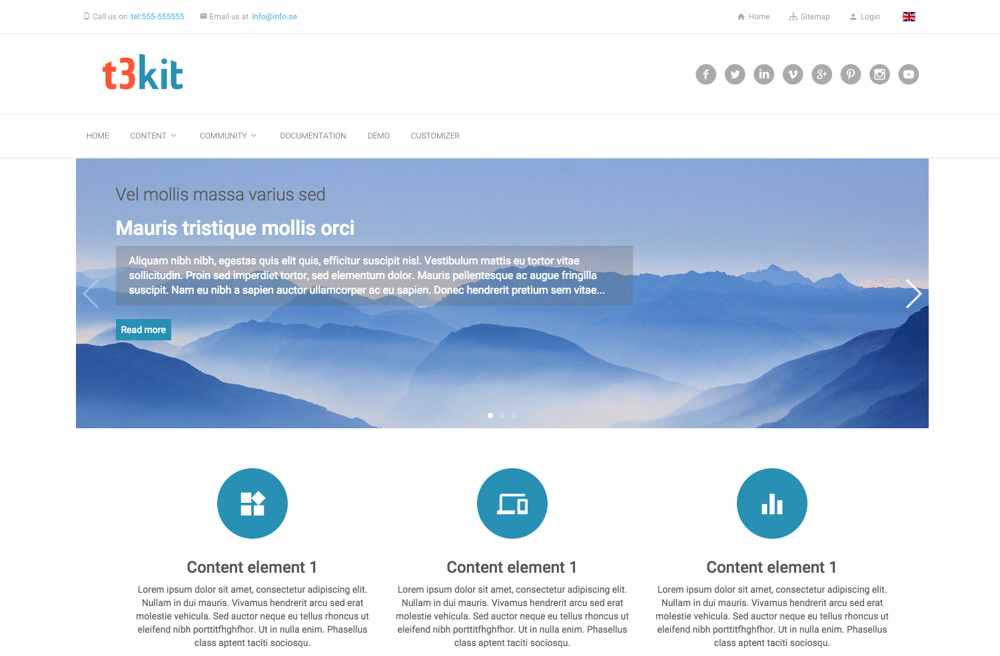

# Theme Blue Mountain

### Theme extension, which allows you to style the t3kit theme in backend without coding

### [CHANGELOG](https://github.com/t3kit/theme_t3kit_bluemountain/blob/master/CHANGELOG.md)
### [Contributing to t3kit](https://github.com/t3kit/t3kit/blob/master/CONTRIBUTING.md)
